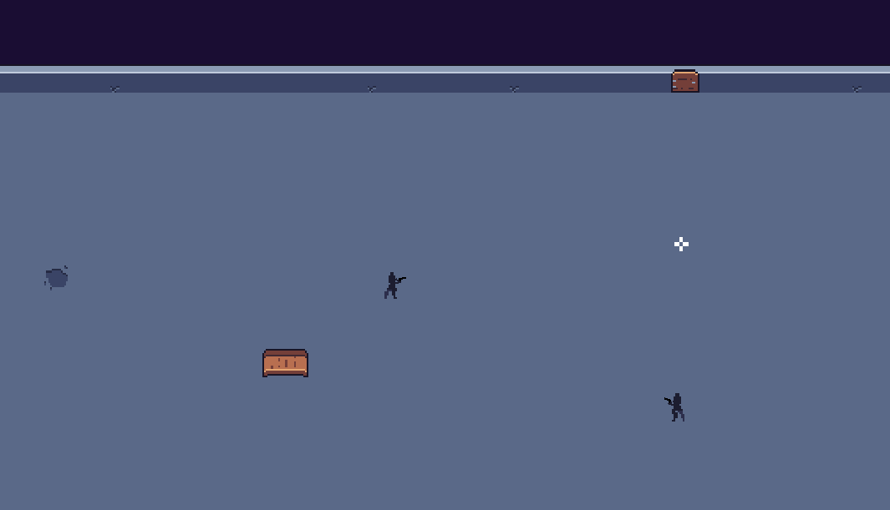

# Arena

Arena is an online multiplayer video game built with Gamemaker Studio 2 and Rust. It uses TCP packets to provide a seamless multiplayer experience.

## Hosting a server

To host a server for Arena, you must download the server executable from the official releases. Then run it with the following commands:

```bash
> server [ip] [port]

# for example
> server 0.0.0.0 8000
```


